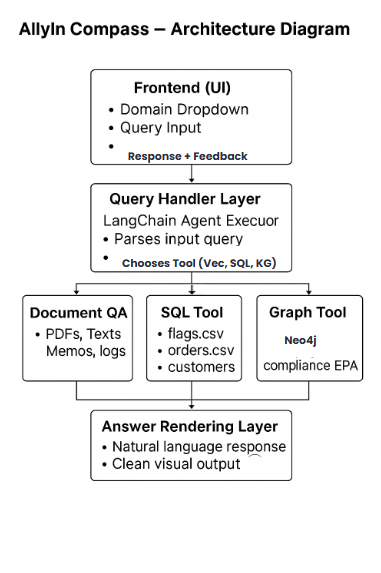

#  AllyIn Compass – Discovery & Intelligence Engine

AllyIn Compass is a smart enterprise assistant designed to answer natural language questions using structured data (SQL), unstructured data (vector search), and graph knowledge bases (Neo4j). It simulates a multi-modal Retrieval-Augmented Generation (RAG) pipeline and uses lightweight fine-tuning with LoRA. Built with LangChain, Streamlit, Neo4j, and DuckDB.

---

## 🚀 Features

* **Multi-modal Querying:** Automatically routes user queries to the best tool (SQL, Vector, or Graph)
* **Compliance & PII Alerts:** Highlights sensitive data or risky terms in responses
* **Observability Dashboard:** Visualizes tool usage, query logs, and response latency
* **Feedback Loop:** Collects thumbs up/down for future iterations and analysis
* **Learning Tools:** Includes RAG-style retrieval and simulated fine-tuning using LoRA 

---

## 📁 Folder Structure

```
AllyIn/
├── agents/                  # Agent logic for tool routing
├── data/                    # Structured CSV + Unstructured docs
├── dashboards/              # Streamlit metrics dashboard
├── feedback/                # Feedback logging
├── notebooks/               # RAG + LoRA experiments
├── security/                # PII + compliance tagging
├── src/retrievers/          # SQL, vector, and graph retrievers
├── ui/                      # Streamlit UI
├── demo_assets/             # Screenshots + demo video
└── README.md
```

---

## 📄 Setup Instructions

```bash
# Clone the repo
https://github.com/aishasartaj1/AllyIn.git

cd AllyIn

# Create a virtual environment
python -m venv venv
source venv/bin/activate  # On Windows: venv\Scripts\activate

# Install dependencies
pip install -r requirements.txt

# Set your environment variables (see .env.template)
cp .env.template .env

# Start Streamlit UI
streamlit run ui/app.py
```
---

## 🧱 Data Setup (Neo4j, Embeddings, SQL)

* **Neo4j**

  ```bash
  docker run -d -p7474:7474 -p7687:7687 --name=allyin-dbms -e NEO4J_AUTH=neo4j/allyin123 neo4j:5.12
  ```

  Then load graph data:

  ```bash
  python src/retrievers/graph_retriever.py
  ```

* **Unstructured Data Embeddings**

  ```bash
  python src/ingest/embedder.py
  ```

* **Structured CSV Loader**

  ```bash
  python src/ingest/structured_loader.py
  ```

---

##  How to Run a Query

1. Launch the Streamlit app.
2. Enter a natural language query like:
  * Top flagged clients in the last year (sql Tool)
  *  Which facilities exceed regulations? (Graph Tool)
  *   Who is the compliance contact for Plant A? (Vector Tool with PII)
  *   Summarize the AllyIn kickoff memo (Vector Tool)
3. The system selects the correct tool and returns an enriched response.

All queries are automatically routed to the right tool. See observability dashboard for logs.

---

## 🧱 Architecture

- **UI:** Streamlit interface in `ui/app.py`
- **Agent:** LangChain zero-shot ReAct agent (`agents/multi_tool_agent.py`) routes queries to tools
- **Tools:** Located in `src/retrievers/`
  - `sql_retriever.py`: Runs DuckDB SQL queries
  - `vector_retriever.py`: Performs Qdrant-based vector search over document embeddings
  - `graph_retriever.py`: Converts natural language to Cypher and queries Neo4j
- **Tagging Modules:**
  - `security/pii_filter.py`: Detects emails, phone numbers, and SSNs
  - `security/compliance_tagger.py`: Flags risky compliance-related keywords
- **Observability:** `dashboards/metrics.py` logs tool selection and response times
- **Feedback Logging:** `feedback/logger.py` records user feedback for learning
- **Data Ingestion (src/ingest/):**
  - `document_parser.py`: Extracts content from PDFs and .eml files
  - `embedder.py`: Embeds documents and stores them in Qdrant
  - `generate_structured.py`: Synthesizes SQL data from raw entries
  - `structured_loader.py`: Loads structured CSV files into DuckDB


---

## 🧪 Tech Stack

* **LangChain**: agent logic and tool chaining
* **Streamlit**: frontend UI
* **Neo4j**: knowledge graph for compliance/inspection queries
* **DuckDB**: lightweight SQL engine
* **OpenAI API**: LLM backend

---

## 🤸️‍💻 Learning Outcomes

* **RAG (Retrieval-Augmented Generation):**

  * Found in: `notebooks/rag_baseline.ipynb`
  * Combines document retrieval + generation

* **LoRA (Low-Rank Adaptation):**

  * Found in: `notebooks/models/lora_adapter/`, `notebooks/simulate_finetuning.ipynb`
  * Simulates fine-tuning LLMs with minimal compute

---
## 🌟 Final Note

This was an amazing learning experience! I explored RAG pipelines, simulated LoRA tuning, built end-to-end tool routing, and strengthened my understanding of observability in AI systems. One area I'd like to improve further is the graph tool's accuracy—especially in translating nuanced questions to Cypher queries. Additionally, I wasn’t very familiar with model scaling and selection before, and it's an area I’m excited to learn more about as I continue growing as an AI engineer.

Thanks for the opportunity!

---

📜 License

This project is open-sourced under the MIT License.

---

🙌 Credits

* Built for AllyIn Discovery Assistant Take-Home Challenge

---

🎥 Demo: [Watch the Demo](https://github.com/aishasartaj1/AllyIn/blob/main/demo_assets/demo.mp4)  
📂 Slide Deck: [View the Slides](https://github.com/aishasartaj1/AllyIn/blob/main/demo_assets/slide_deck.pdf)


